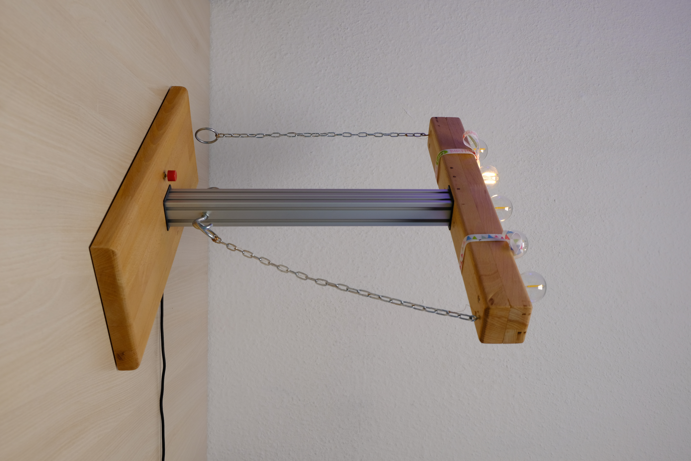

In diesem Repo findet Ihr weiterführende Dateien und Informationen zu unserer Modifikation des Ringspiels.

# Aufbau:

## Gesamtabmessungen

 

## Fräsungen

Verkabelung im oberen Querbalken:

 

Verkabelung auf der Unterseite: 

## Haken und Kette

# Informationen zur Konfiguration des USB-C Ports